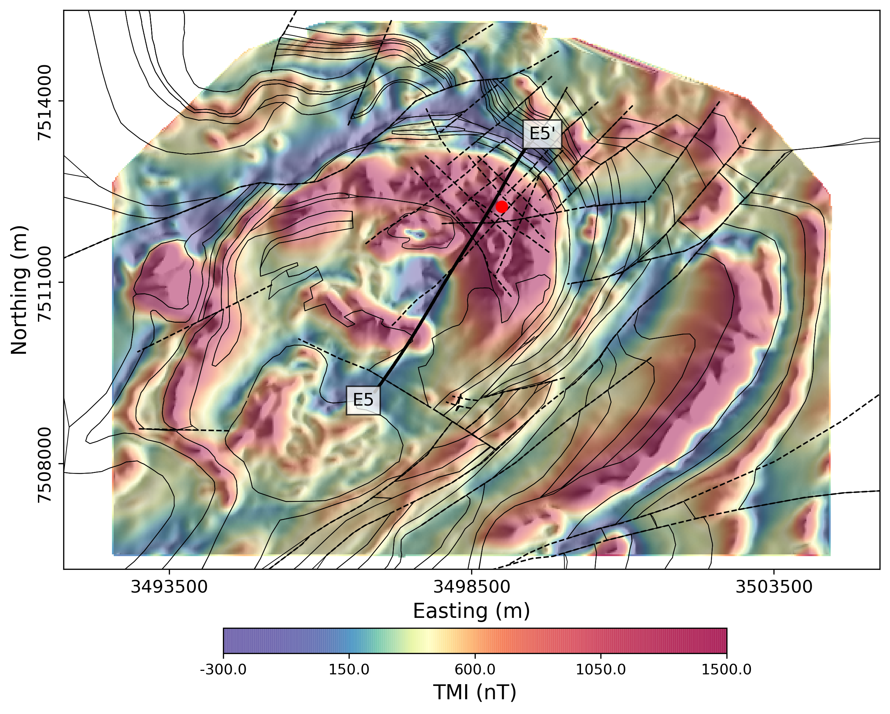

# Template repository for papers by the GIF group

Please use this repository as a template for papers

## Repository name

The naming convention should follow 

```
year-authors-journal-short-title
```

As an example for two authors: 
```
2023-heagy-oldenburg-gji-casing-permeability
```

if there are more than 2 authors, you can use `etal` to indicate multiple authors, e.g. 
```
2024-heagy-etal-tle-future-of-applied-geophysics
```

## Contents

The paper should be put in a `paper` folder. You can put the original latex there. The published pdf from the journal should also be included here. 

Please also include a `thumbnail.png`. This should be a high-impact figure from the paper. 

## MyST.md

The key file that you will need to update is the `myst.yml` file which is located in the `paper` folder. You will need to fill out the fields that are currently commented out. 

The project id should follow the pattern `ubcgif-YEAR-AUTHORS-JOURNAL`, e.g. `ubcgif-2023-heagy-oldenburg-gji` or `2024-heagy-etal-tle`

Descriptions of the fields is available here: https://mystmd.org/guide/frontmatter#available-frontmatter-fields

## Previewing the site

You can preview the build using MyST. Please have MyST installed ([instructions](https://mystmd.org/guide/installing)). From the `paper` folder, you can then run 

```
myst start
```

and a preview will launch, usually from `http://localhost:3000`

Also, whenever you create a pull-request to the repo, curvenote will build you a preview 🚀. A link will be added to the comment thread that looks something like this 


## README 
Please use the following as a template for the 
```
# Template repository for papers

_Authors_

[https://doi.org/XXX](https://doi.org/XXX)



## Summary

Summary of the paper here (pulled from abstract/summary of paper) 

## Citation

Please include the formatted citation along with bibtex for the reference

```

## Examples
- https://github.com/ubcgif/2023-heagy-oldenburg-gji-casing-permeability
- https://github.com/ubcgif/2024-heagy-etal-tle-future-of-applied-geophysics
